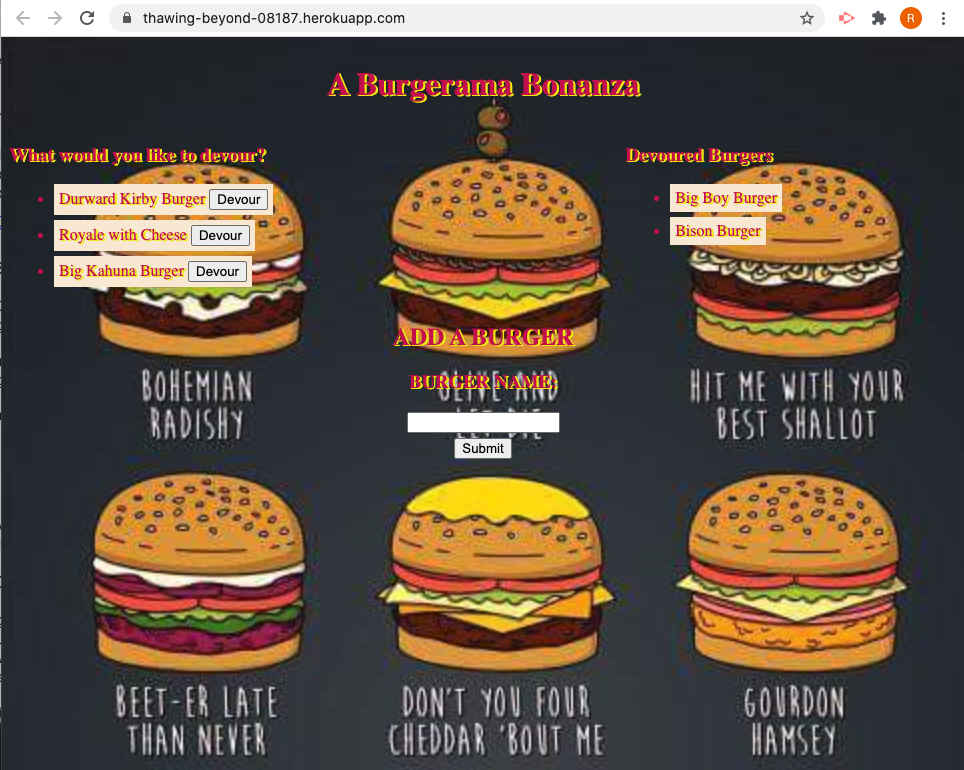
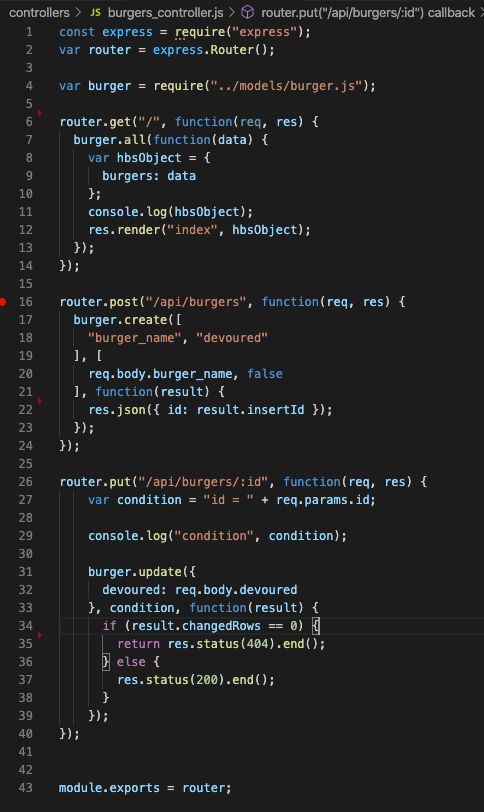

# node-express-handlebars

## Description

Create a Burger logger with MySQL, Node, Express, Handlebars, and a homemade ORM to let a user add a Burger and then devour it. App will store every burger in a database, whether devoured or not. 

## Built With
- MySQL
- Node
- Express
- Handlebars
- ORM
- JSON
- Javascript
- HTML
- CSS

## ScreenShot

## Code Snippet

## Deployed Links
- https://thawing-beyond-08187.herokuapp.com/
-  https://ryandelonhull.github.io/node-express-handlebars/

## Author 

### Ry Hull
 - https://github.com/ryandelonhull
 - https://linkedin.com/in/ryan-hull-94003144
 - 

  ## *Acknowledgments*

 Big thank you to Roger, Kerwin, Manuel and my tutor for wading into the deep waters of coding with the class and keeping me afloat with their instruction and guidance. Thank you to my fellow classmates for including me in the study and homework sessions as working together on a problem has been a great teacher also.

